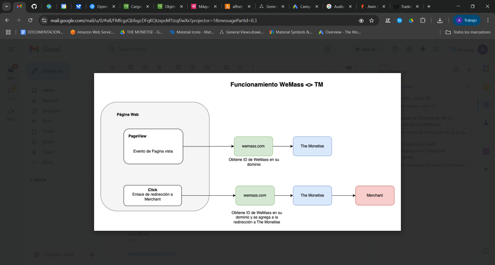

# Doc Tarea


***

***

### Doc

***

***

### Imagenes

<figure><figcaption></figcaption></figure>

***

***

### Documentos extra

***

#### Estructura del Dato

Breve descripción de campos:

* **date** (`string`): Fecha
* **client\_name** (`string`): Nombre del cliente
* **brand\_name** (`string`): Nombre de Marca
* **category** (`string`): Nombre de la categoría de la marca
* **affiliate\_network\_name** (`string`): Nombre de la red de afiliación
* **link** (`string`): URL del enlace clicado
* **client\_user\_id** (`string`): Identificador único del usuario en el sistema del WeMass
* **referrer\_normalized** (`string`): Referer normalizado que originó el tráfico. Dominio de donde vino el usuario antes de llegar al contenido
* **operative\_system\_name** (`string`): Nombre del sistema operativo utilizado por el usuario
* **country** (`string`): Nombre de País
* **browser\_name** (`string`): Nombre del navegador utilizado por el usuario
* **device\_name** (`string`): Tipo del dispositivo empleado por el usuario
* **product\_name** (`string`): Nombre del producto comprado asociado al evento o acción
* **normalized\_category** (`string`): Nombre de la categoría asociada al contenido donde ocurrió la acción
* **clicks** (`bigint`): Número total de clics registrados
* **indirect\_purchases** (`bigint`): Cantidad de compras indirectas generadas a través del enlace en Amazon
* **amazon\_thirdparty** (`bigint`): Compras realizadas a través de vendedores de terceros en Amazon
* **purchases** (`bigint`): Número total de compras generadas
* **pageviews** (`bigint`): Número de páginas vistas

***

#### Datos WeMass

Este documento muestra ejemplos de los 3 tipos de información que envía **The Monetise** a **WeMass**.

Página Vista

```json
{
  "date": "2025-01-29",
  "client_name": "La Vanguardia",
  "client_user_id": "90541e4cc62e52363756adc83d911803ad75374cb2",
  "operative_system_name": "Android",
  "country": "ES",
  "browser_name": "Chrome",
  "device_name": "Mobile",
  "normalized_category": "Belleza",
  "indirect_purchases": 0,
  "amazon_thirdparty": 0,
  "clicks": 0,
  "purchases": 0,
  "pageviews": 1
}
```

Click

```json
{
  "date": "2025-01-29",
  "client_name": "La Vanguardia",
  "brand_name": "Amazon",
  "category": "General",
  "affiliate_network_name": "Amazon",
  "link": "https://www.amazon.es/dp/B0CPJ83D4N",
  "client_user_id": "2d8774d758db07a65a26767a1a47716da7b122c16c",
  "operative_system_name": "Windows",
  "country": "ES",
  "browser_name": "Chrome",
  "device_name": "Desktop",
  "normalized_category": "Tecnologia",
  "indirect_purchases": 0,
  "amazon_thirdparty": 0,
  "clicks": 1,
  "purchases": 0,
  "pageviews": 0
}
```

Compra

```json
{
  "date": "2025-05-15",
  "client_name": "Hola",
  "brand_name": "Amazon",
  "category": "General",
  "affiliate_network_name": "Amazon",
  "link": "https://www.amazon.es/dp/B07MWC38QN",
  "client_user_id": "5015049aea6def7208fdb45f9aa78b5eb325c9afac",
  "referrer_normalized": "google",
  "operative_system_name": "iOS",
  "country": "ES",
  "browser_name": "Safari",
  "device_name": "Mobile",
  "product_name": "Sawyer Bikes Bicicleta Sin Pedales Ultraligera Niños 2, 3",
  "normalized_category": "Juguetes",
  "indirect_purchases": 1,
  "amazon_thirdparty": 0,
  "clicks": 0,
  "purchases": 1,
  "pageviews": 0
}

```
